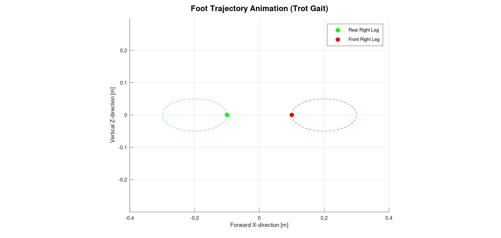

# Footsteps Planning

## Bipeds

### 1) Global Trajectory

    

### 2) 2D Footsteps Planning

    

### 3) 3D Feet Trajectory Planning

    

### 4) ZMP Trajectory Generation

    

### 5) CoM Pelvis Trajectory Generation

#### 5.1) Dynamics Relations with ZMP

    

#### 5.2) Open-Loop Sine Wave 

    

## Quadrupeds

### 3D Feet Trajectory

    

