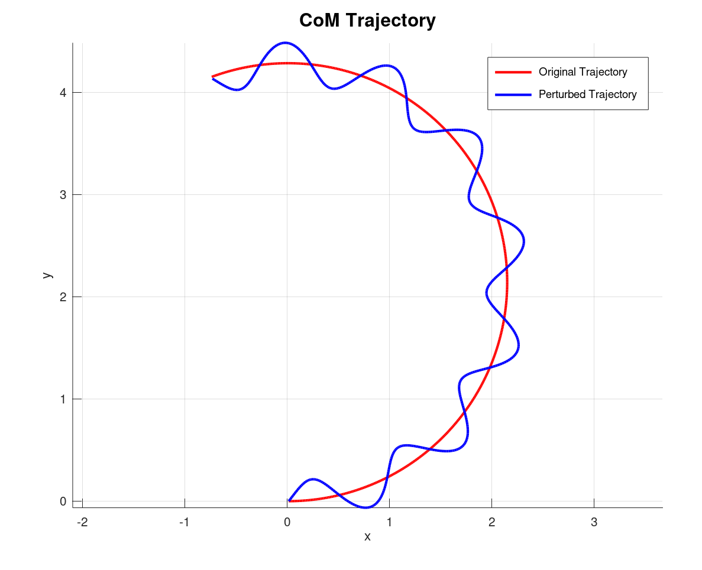

# Footsteps Planning

## Bipeds

### 1) Global Trajectory

    
    
<em>Global Trajectory</em>

### 2) 2D Footsteps Planning

*2D Footsteps Planning*

### 3) 3D Feet Trajectory Planning

*3D Feet Trajectory Planning*

### 4) ZMP Trajectory Generation

*ZMP Trajectory Generation*

### 5) CoM Pelvis Trajectory Generation

#### 5.1) Dynamics Relations with ZMP

*CoM Trajectory Generation*

#### 5.2) Open-Loop Sine Wave 

*CoM Trajectory Generation*

## Quadrupeds

### 3D Feet Trajectory

*3D Feet Trajectory Planning for Trot Gait: Rear Right and Front Right Feet*
