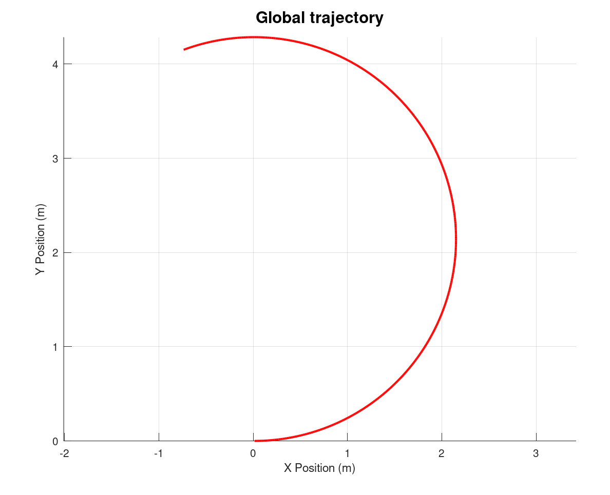
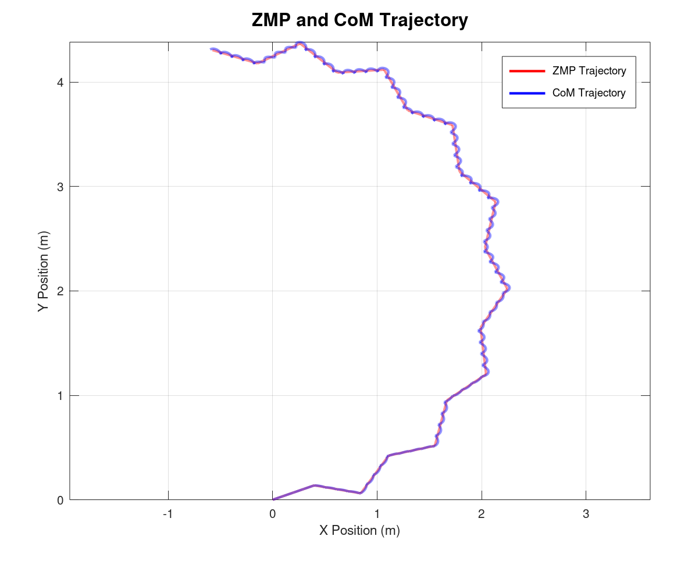
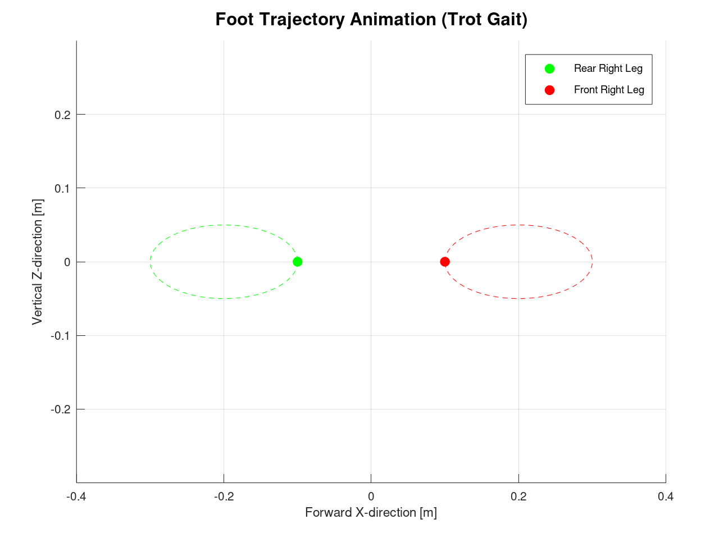

# Footsteps Planning

Footstep planning is a fundamental component of locomotion for legged robots, allowing them to move efficiently and adaptively in complex environments. Whether it’s a biped navigating a cluttered household or a quadruped traversing uneven terrain, this process involves generating precise foot trajectories while considering the robot's dynamics and stability constraints.

Typically, the planning process consists of two stages:

- **Global Path Planning**: This module computes a high-level path for the robot to follow, usually avoiding obstacles and determining a viable route.
- **Footstep Planning**: Based on the global path, this step computes the exact placement of each foot to ensure the robot follows the intended trajectory.

## Bipeds

Footstep planning for bipeds typically involves generating foot placements in both 2D and 3D spaces. In addition to foot placements, the trajectories of the robot’s Center of Mass (CoM) and the Zero Moment Point (ZMP) play a vital role in maintaining balance. The CoM trajectory ensures the robot's weight remains balanced, while the ZMP trajectory prevents tipping by maintaining stability during walking.

### 1) Global Trajectory

    

### 2) 2D Footsteps Planning

    

### 3) 3D Foot Trajectory Planning

    

### 4) ZMP Trajectory Generation

what is ZMP, what is support polygon.

    

### 5) CoM Pelvis Trajectory Generation

#### 5.1) Dynamics Relations with ZMP

    

#### 5.2) Open-Loop Sine Wave 

    

## Quadrupeds

Quadrupeds, with their four-legged structure, offer inherent stability but require precise coordination between legs for smooth and efficient movement. Locomotion in quadrupeds is characterized by various gait patterns, each suited for specific speeds or terrains. Effective footstep planning for quadrupeds involves managing the "phase" of each leg’s movement, which refers to whether a leg is in the *stance phase* (in contact with the ground) or the *swing phase* (moving forward through the air).

Common Gait Patterns:

- **Walk**: A slow, stable gait where legs move one at a time, ensuring at least three points of contact with the ground at all times.
- **Trot**: A faster gait where diagonally opposite legs move together in pairs, offering a balance of speed and stability.
- **Gallop**: A dynamic gait used for higher speeds, featuring a suspended phase where all legs are momentarily off the ground.

### 3D Foot Trajectory

    

### 3D Foot Trajectory for Quadrupeds

The 3D foot trajectory describes the path of each foot in three-dimensional space (x, y, z) throughout the gait cycle. For quadrupeds, we use an elliptical trajectory to represent the foot motion in the xz-plane:

$$
\text{foot}_x(t) = A_x \cos(\phi(t))
$$
$$
\text{foot}_z(t) = -A_z \sin(\phi(t))
$$

Where:
- $A_x$ is the amplitude of the foot movement in the forward (x) direction.
- $A_z$ is the amplitude of the vertical (z) direction.

While $\phi(t)$ is the phase at time $t$, and is defined as:

$$
\phi(t) = \phi_0 + 2 \pi f_0 t
$$

Where:
- $\phi_0$ is the initial phase of the leg.
- $f_0$ is the frequency of the gait.
- $t$ is the time at which the foot trajectory is computed.

In our example, we choose to perform a Trot Gait. Thus, the legs move in a diagonal gait pattern, where the front left leg and the rear right leg move together, and the front right leg and rear left leg move together in the opposite phase. The phase shifts $\phi_0$ between these legs are defined as:

- Front Left Leg: $\phi_{\text{FL}} = 0$
- Rear Right Leg: $\phi_{\text{RR}} = 0$
- Front Right Leg: $\phi_{\text{FR}} = \pi$ (opposite phase to FL and RR)
- Rear Left Leg: $\phi_{\text{RL}} = \pi$ (opposite phase to FL and RR)

This approach allows for precise control over the motion of each foot, enabling smooth and stable locomotion.
