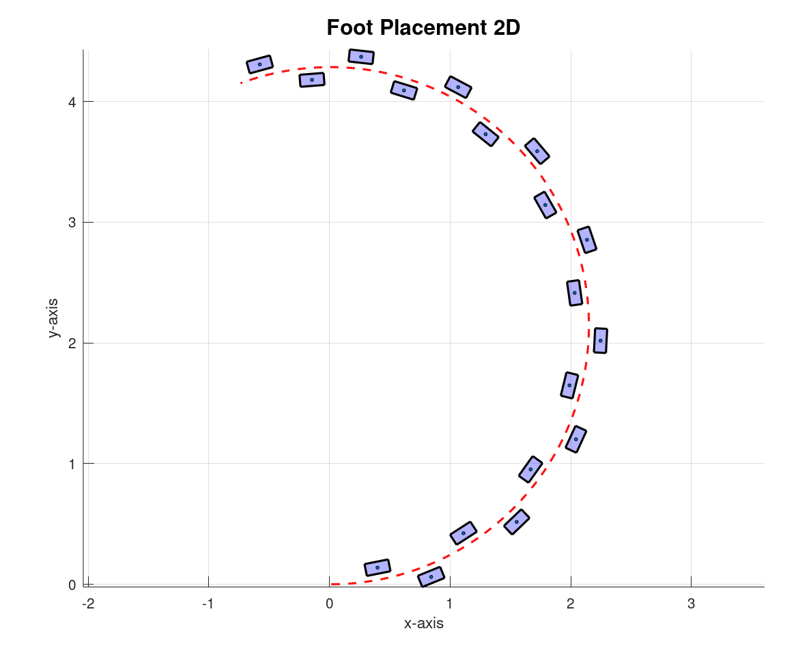
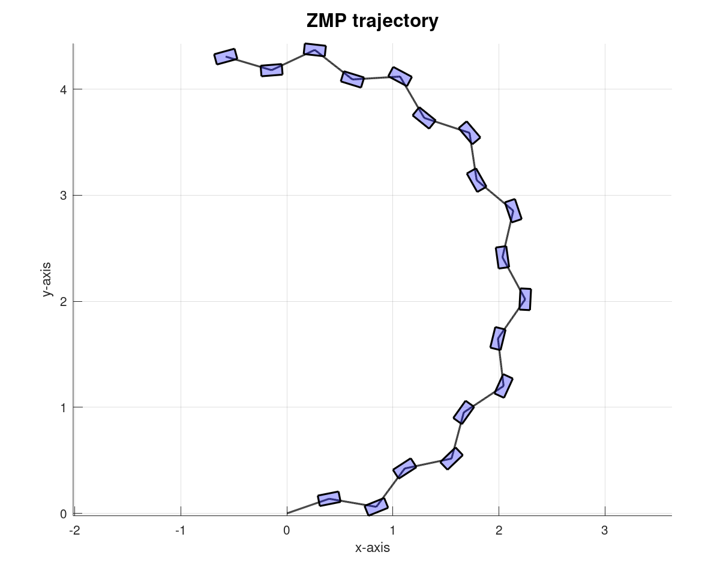

# Footsteps Planning

Footstep planning is a fundamental component of locomotion for legged robots, allowing them to move efficiently and adaptively in complex environments. Whether it’s a biped navigating a cluttered household or a quadruped traversing uneven terrain, this process involves generating precise foot trajectories while considering the robot's dynamics and stability constraints.

Typically, the planning process consists of two stages:

- **Global Path Planning**: This module computes a high-level path for the robot to follow, usually avoiding obstacles and determining a viable route.
- **Footstep Planning**: Based on the global path, this step computes the exact placement of each foot to ensure the robot follows the intended trajectory.

## Bipeds

Footstep planning for bipeds typically involves generating foot placements in both 2D and 3D spaces. In addition to foot placements, the trajectories of the robot’s Center of Mass (CoM) and the Zero Moment Point (ZMP) play a vital role in maintaining balance. The CoM trajectory ensures the robot's weight remains balanced, while the ZMP trajectory prevents tipping by maintaining stability during walking.

**Note**: All these reference trajectories (footsteps, CoM) will be then followed by a high-level tracking controller. However, the design and implementation of such a controller is beyond the scope of this article.

### 1) Global Trajectory

<div>
    
</div><br>

The global trajectory represents the motion of a robot from a starting location to a goal location, typically computed by a high-level planner. This planner generates an obstacle-free sequence of positions for the robot to follow.

However, in this example, we generate a simplified trajectory using just two primary inputs:

- **Linear velocity**: The forward speed $v$ of the robot.
- **Angular velocity**: The rate of rotation $w$ of the robot around its vertical axis.

Given these inputs, the robot’s trajectory can be computed over a time interval $T$ using small time steps of duration $\Delta T$. At each step, the position ($x, y$) and orientation $\theta$ are updated iteratively based on the following equations of motion:

- $x_{i+1} = x_i + v \cos(\theta_i) \Delta T$
- $y_{i+1} = y_i + v \sin(\theta_i) \Delta T$
- $\theta_{i+1} = \theta_i + w \Delta T$

This method provides a simple way to simulate a global trajectory for navigation tasks.

### 2) 2D Footsteps Planning

<div>
    
</div><br>

2D Footstep Planning involves generating precise foot placements around the global trajectory, alternating between the left and right foot. Key parameters include:

- **Step Length L**: The forward distance between consecutive foot placements.
- **Step Width W**: The lateral distance between the left and right feet.

#### Steps of the Algorithm:

1. **Tangent and Normal Calculation**: At each point along the trajectory, a tangent vector $\mathbf{t} = [\cos(\theta), \sin(\theta)]$ is computed to determine the robot’s direction of motion. The normal vector $\mathbf{n}$ is derived from the tangent to define lateral offsets for foot placement:
   
$$
\mathbf{n} = [-\sin(\theta), \cos(\theta)]
$$

2. **Foot Placement**:
   A new foot placement is added whenever the robot travels a distance equal to the step length $L$. The position of the foot is calculated as:

```math
x_{\text{foot}} = x_{\text{trajectory}} + \frac{W}{2} \cdot n_x \cdot (2 \cdot \text{is\_right\_foot} - 1)
```

```math
y_{\text{foot}} = y_{\text{trajectory}} + \frac{W}{2} \cdot n_y \cdot (2 \cdot \text{is\_right\_foot} - 1)
```

The orientation of the foot is set to align with the tangent:

```math
\theta_{\text{foot}} = \arctan2(t_y, t_x)
```

4. **Alternating Steps**:
   The algorithm alternates between placing left and right foot positions, ensuring symmetric gait patterns.

By following this approach, the robot can accurately generate a sequence of 2D foot placements that follow the global trajectory while adhering to step length and width constraints.


### 3) 3D Foot Trajectory Planning

<div>
    
</div><br>

3D Foot Trajectory Planning extends the 2D footstep positions into a fully defined 3D trajectory, including height variations for each step. 

Each step's trajectory is defined as a sequence of homogeneous transformations in 3D space, generated from the following elements:

- **2D footsteps**: The 2D feet positions generated from the previous step.
- **Step Height**: The vertical lift of the foot, ensuring clearance over obstacles.
- **Step Time**: The duration of each step.

#### Algorithm Steps:

1. **Time Normalization**:
   Each single step trajectory is generated over a normalized time interval $[0, 1]$, split into $n$ discrete steps:
   
$$
t = \text{linspace}(0, 1, n)
$$

2. **Interpolation for x, y Trajectory**:
   The positions in the $x-y$ plane are interpolated between the start and end positions of the step using cubic splines:

$$
x_{\text{traj}}(t) = \text{interp}(x_{\text{start}}, x_{\text{end}}, t)
$$

$$
y_{\text{traj}}(t) = \text{interp}(y_{\text{start}}, y_{\text{end}}, t)
$$

3. **Parabolic z Trajectory**:
   To ensure smooth lifting and landing, the $z$-trajectory follows a parabolic profile:

$$
z_{\text{traj}}(t) = 4 \cdot H \cdot t \cdot (1 - t)
$$

4. **Homogeneous Transformation Matrices**:
   At each time step, the 3D foot position is represented as a homogeneous transformation matrix:
   
$$
T(t) =
\begin{bmatrix}
R_z(\theta) & \mathbf{p}(t) \\
0 & 1
\end{bmatrix}
$$

   where:
- $R_z(\theta)$ is the rotation matrix for the foot orientation around $z$-axis:

$$
R_z(\theta) =
\begin{bmatrix}
\cos(\theta) & -\sin(\theta) & 0 \\
\sin(\theta) & \cos(\theta) & 0 \\
0 & 0 & 1
\end{bmatrix}
$$

- $\theta$ is the foot orientation. 
- $\mathbf{p}(t) = [x_{\text{traj}}(t), y_{\text{traj}}(t), z_{\text{traj}}(t)]^\top$ is the 3D position of the foot.

This process generates a sequence of 3D foot placements that follow the global trajectory, by computing poth 3D positions and 3D orientations for each foot.

### 4) ZMP Trajectory Generation

<div>
    
</div><br>

The **Zero Moment Point (ZMP)** is a critical concept in legged locomotion, serving as a stability indicator for robots. It represents the point on the ground where the resultant moment of forces, generated by gravity and inertia, equals zero. In simpler terms, the ZMP helps determine if the robot’s motion is dynamically stable. If the ZMP lies within the support polygon, the robot is stable and unlikely to tip over.

#### What is the Support Polygon?

The **Support Polygon** is the area enclosed by the contact points of the robot's feet with the ground. For example:
- For a biped robot in a single support phase, the support polygon is the area under the single foot in contact.
- For a biped in a double support phase, the support polygon is the area formed between both feet.

The ZMP must remain inside the support polygon to maintain stability. If it moves outside, the robot becomes unstable and risks falling.

#### ZMP Trajectory Generation

To generate a smooth and stable ZMP trajectory, the planned 2D footstep positions serve as the foundation. Using cubic spline interpolation, a continuous and smooth path is calculated between consecutive footstep positions. This interpolation method guarantees that the ZMP trajectory transitions naturally between steps without abrupt changes, maintaining stability. The resulting trajectory consists of a series of smooth points $(x_{\text{ZMP}}, y_{\text{ZMP}})$ that lie within the support polygon, ensuring dynamic balance throughout the robot’s motion.

### 5) CoM Pelvis Trajectory Generation

The Center of Mass (CoM) trajectory plays a critical role in ensuring the robot remains dynamically stable during motion. We can procede in couple of ways to compute this reference.

#### 5.1) Dynamics Relations with ZMP

<div>
    
</div><br>

 The CoM and the ZMP relationship can be expressed through the Linear Inverted Pendulum (LIP) model, which is a simplified dynamic representation of a robot's motion.

#### **Linear Inverted Pendulum (LIP) Model**

<div><br>
    
</div><br>

The LIP model assumes the following:
- The robot's mass is concentrated at its CoM.
- The CoM moves at a constant height $h$ above the ground.
- The contact forces act at the ZMP, which lies within the support polygon.

<div><br>
    
</div><br>

Using these assumptions, the horizontal CoM accelerations are directly related to the ZMP position. Indeed, recalling the ZMP definition (*it represents the point on the ground where the resultant moment of forces equals zero*), the following dynamic equations hold:

```math
M_{y_{{zmp}}} = m \cdot \ddot{x}_{\text{CoM}} \cdot {z}_{\text{CoM}} - mg \cdot (\dot{x}_{\text{CoM}} - x_{\text{ZMP}}) = 0
```

```math
M_{x_{{zmp}}} = m \cdot \ddot{y}_{\text{CoM}} \cdot {z}_{\text{CoM}} - mg \cdot (\dot{y}_{\text{CoM}} - y_{\text{ZMP}}) = 0
```

Rearranging the equations, we obtain:

```math
\ddot{x}_{\text{CoM}} = \frac{g}{h} (x_{\text{CoM}} - x_{\text{ZMP}})
```

```math
\ddot{y}_{\text{CoM}} = \frac{g}{h} (y_{\text{CoM}} - y_{\text{ZMP}})
```

where:

- $\ddot{x}_{\text{CoM}}$ is the acceleration of the CoM in the $x$-direction.
- $\ddot{y}_{\text{CoM}}$ is the acceleration of the CoM in the $y$-direction.
- $x_{\text{ZMP}}$ and $y_{\text{ZMP}}$ are the ZMP coordinates in the $x$- and $y$-directions.
- $g$ is the gravitational constant.
- $h$ is the constant height of the CoM above the ground.

#### **Computation of CoM Trajectory**

The CoM trajectory can be calculated iteratively using the ZMP trajectory as input. At each time step, the following steps are performed:

1. Compute the CoM acceleration:

```math
\ddot{x}_{\text{CoM}} = \frac{g}{h} (x_{\text{CoM}} - x_{\text{ZMP}})
```

```math
\ddot{y}_{\text{CoM}} = \frac{g}{h} (y_{\text{CoM}} - y_{\text{ZMP}})
```

3. Integrate the acceleration to update the CoM velocity:

```math
\dot{x}_{\text{CoM}} = \dot{x}_{\text{CoM}} + \ddot{x}_{\text{CoM}} \cdot \Delta t
```

```math
\dot{y}_{\text{CoM}} = \dot{y}_{\text{CoM}} + \ddot{y}_{\text{CoM}} \cdot \Delta t
```

5. Integrate the velocity to update the CoM position:

```math
x_{\text{CoM}} = x_{\text{CoM}} + \dot{x}_{\text{CoM}} \cdot \Delta t
```

```math
y_{\text{CoM}} = y_{\text{CoM}} + \dot{y}_{\text{CoM}} \cdot \Delta t
```

The resulting trajectory $(x_{\text{CoM}}, y_{\text{CoM}})$ provides a smooth and stable path for the robot's Center of Mass, ensuring dynamic balance throughout the motion.


#### 5.2) Open-Loop Sine Wave 

<div>
    
</div><br>

Another alternative to generate the CoM trajectory consists in introducing a sinusoidal perturbation around the global trajectory. This perturbation, added along the normal direction at each point, mimics the lateral oscillations observed in biological locomotion. While this approach doesn't derive directly from dynamic equations, it is inspired by the natural, rhythmic oscillations seen in biological systems. 

#### Sinusoidal Perturbation Model

The sinusoidal perturbation is defined as:

$$
s(t) = A \cdot \sin\left(\frac{2 \pi s_{\text{arc}}}{\lambda}\right)
$$

where:
- $A$: Amplitude of the sine wave, controlling the lateral deviation of the CoM.
- $\lambda$: Wavelength of the sine wave, determining the frequency of oscillation.
- $s_{\text{arc}}$: The arc length along the robot's trajectory.

#### Generating the Perturbed CoM Trajectory

1. **Compute Arc Length**:
   The arc length is computed incrementally along the trajectory as:
   
```math
s(i) = s(i-1) + \sqrt{\left(x(i) - x(i-1)\right)^2 + \left(y(i) - y(i-1)\right)^2}
```

3. **Tangent and Normal Vectors**:
   At each point, the tangent vector $\vec{t}$ is calculated as:
   
```math
\vec{t} = \frac{\partial \vec{p}}{\partial s} = \left( \frac{\partial x}{\partial s}, \frac{\partial y}{\partial s} \right)
```
   
   The normal vector $\vec{n}$ is derived by rotating the tangent vector 90°:
   
```math
\vec{n} = (-t_y, t_x)
```

5. **Apply Perturbation**:
   The sine wave perturbation is applied along the normal vector:

```math
\vec{p}_{\text{perturbed}} = \vec{p}_{\text{global\_trajectory}} + s(t) \cdot \vec{n}
```

This simpler approach generates an open-loop CoM trajectory, simulating oscillating gait patterns often observed in biological locomotion. 

## Quadrupeds

Quadrupeds, with their four-legged structure, offer inherent stability but require precise coordination between legs for smooth and efficient movement. Locomotion in quadrupeds is characterized by various gait patterns, each suited for specific speeds or terrains. Effective footstep planning for quadrupeds involves managing the "phase" of each leg’s movement, which refers to whether a leg is in the *stance phase* (in contact with the ground) or the *swing phase* (moving forward through the air).

Common Gait Patterns:

- **Walk**: A slow, stable gait where legs move one at a time, ensuring at least three points of contact with the ground at all times.
- **Trot**: A faster gait where diagonally opposite legs move together in pairs, offering a balance of speed and stability.
- **Gallop**: A dynamic gait used for higher speeds, featuring a suspended phase where all legs are momentarily off the ground.

### 3D Foot Trajectory for Quadrupeds

<div>
    
</div><br>

The 3D foot trajectory describes the path of each foot in three-dimensional space (x, y, z) throughout the gait cycle. For quadrupeds, we use an elliptical trajectory to represent the foot motion in the xz-plane:

$$
\text{foot}_x(t) = A_x \cos(\phi(t))
$$
$$
\text{foot}_z(t) = -A_z \sin(\phi(t))
$$

Where:
- $A_x$ is the amplitude of the foot movement in the forward (x) direction.
- $A_z$ is the amplitude of the vertical (z) direction.

While $\phi(t)$ is the phase at time $t$, and is defined as:

$$
\phi(t) = \phi_0 + 2 \pi f_0 t
$$

Where:
- $\phi_0$ is the initial phase of the leg.
- $f_0$ is the frequency of the gait.
- $t$ is the time at which the foot trajectory is computed.

In our example, we choose to perform a Trot Gait. Thus, the legs move in a diagonal gait pattern, where the front left leg and the rear right leg move together, and the front right leg and rear left leg move together in the opposite phase. The phase shifts $\phi_0$ between these legs are defined as:

- Front Left Leg: $\phi_{\text{FL}} = 0$
- Rear Right Leg: $\phi_{\text{RR}} = 0$
- Front Right Leg: $\phi_{\text{FR}} = \pi$ (opposite phase to FL and RR)
- Rear Left Leg: $\phi_{\text{RL}} = \pi$ (opposite phase to FL and RR)

This approach allows for precise control over the motion of each foot, enabling smooth and stable locomotion.

## Key Works and Citations

- **Clement Gaspard**: [*FootstepNet: an Efficient Actor-Critic Method for Fast On-line Bipedal Footstep Planning*](https://arxiv.org/pdf/2403.12589v2)
- **Shuuji Kajita**: [*The 3D Linear Inverted Pendulum Mode: a simple modeling for a biped walking pattern generation*](https://www.cs.cmu.edu/~hgeyer/Teaching/R16-899B/Papers/KajiitaEA01IEEE_ICIRS.pdf)
- **Shuuji Kajita**: [*Biped Walking Pattern Generation by using Zero-Moment Point*](https://mzucker.github.io/swarthmore/e91_s2013/readings/kajita2003preview.pdf)
- **Maurice Rahme**: [*Spot Mini Mini Open Source*](https://moribots.github.io/project/spot-mini-mini)


